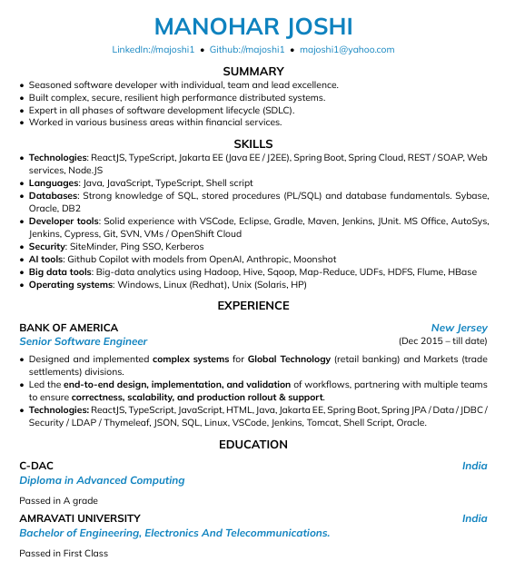

This is an Attractive Resume Template built with Typst, an open source Latex alternative written in Rust, and compiles to PDF.

To compile it to pdf, make sure typst is installed. The provided flake.nix and .envrc is useful if you have nix and direnv installed. This template using the Mulish Google Font and is provided in the `assets/fonts` directory.


```
# Typ to pdf

## One time
winget install typst

## Each time (from powershell)
typst compile --font-path ./assets/fonts resume.typ resume.pdf

# To markdown

## One time
winget install --source winget --exact --id JohnMacFarlane.Pandoc

## Each time (from powershell)
pandoc resume.typ -o resume.md
```

Preview:\

